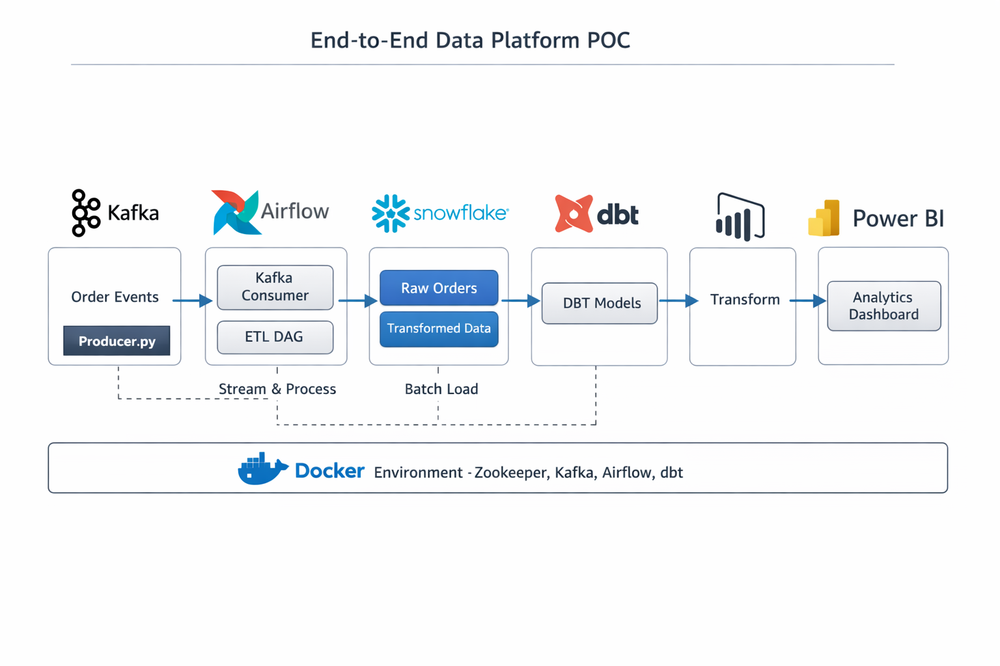

step 0 
docker compose up -d
Confirm:
Kafka running
Airflow UI → http://localhost:8080
step 1
▶️ Run Producer
python kafka/producer.py

step-2
▶️ Trigger DAG
Open Airflow UI
Trigger kafka_to_snowflake

step -3
🔍 Check Data in Snowflake
SELECT * FROM analytics_db.raw.user_events;

step - 4
▶️ Run dbt
dbt run

🔍 Output Table
SELECT * FROM analytics_db.staging.stg_user_events;

✅ STEP 5: DBT – MART (BUSINESS LOGIC)
🔍 Final Analytics Table
SELECT * FROM analytics_db.marts.fct_user_events;

--------------------------------------------------------
9️⃣ POWER BI

Connect Power BI Desktop → Snowflake

Database: DEMO_DB → Schema: PUBLIC → Table: FCT_ORDERS

Create visuals:

Total revenue by customer

Number of orders by customer

Trend chart on event_time

---------------------------------------------------------
10️⃣ FINAL NOTES

Run Docker:

docker compose up -d

Start Kafka producer: python kafka/producer.py

Trigger Airflow DAG via UI

Check Snowflake RAW_ORDERS → dbt runs → FCT_ORDERS

Build Power BI dashboard

---------------------------------------------------------

quit docker from powershell
--wsl --shutdown

🔹 STEP 1: ENTER AIRFLOW CONTAINER
docker exec -it data-platform-poc-airflow-1 bash

You should now be inside the container:

airflow@xxxxxxxx:/opt/airflow$

🔹 STEP 2: INITIALIZE AIRFLOW METADATA DB (MANDATORY)

Run inside container:

airflow db init

⏳ Takes ~30–60 seconds
Expected end message:

Initialization done

🔹 STEP 3: CREATE AIRFLOW ADMIN USER

Run (safe even if user exists):

airflow users create \
  --username airflow \
  --password airflow \
  --firstname Admin \
  --lastname User \
  --role Admin \
  --email admin@example.com

🔹 STEP 4: START WEB SERVER + SCHEDULER

Still inside container:

airflow webserver -p 8080 &
airflow scheduler &

Wait 15–20 seconds.

🔹 STEP 5: OPEN AIRFLOW UI (NOW IT WILL WORK)

Open browser:

http://localhost:8080

Login:

Username: airflow
Password: airflow

✅ UI WILL open now

notepad C:\Users\admin\.wslconfig
[wsl2]
memory=4GB       # Limits WSL2 RAM to 4GB
processors=2     # Limits WSL2 to 2 CPUs
swap=1GB         # Optional swap
localhostForwarding=true